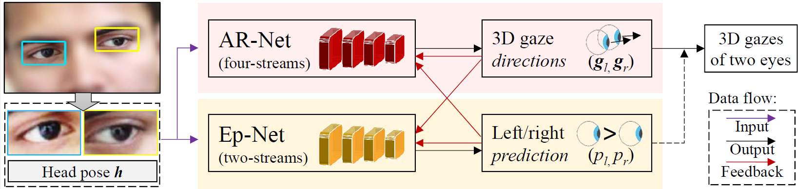
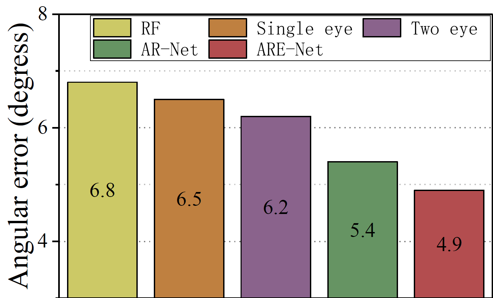
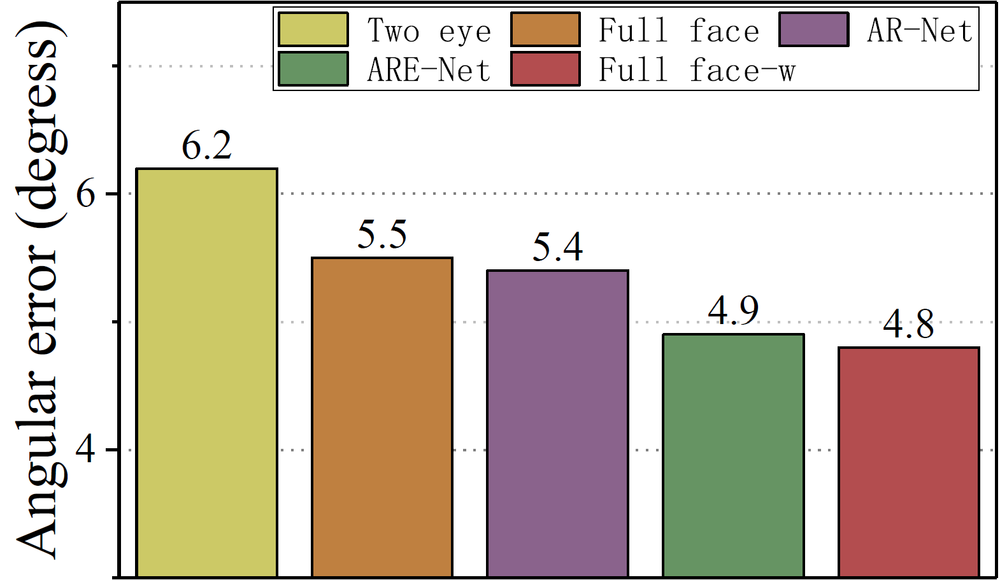

# Asymmetric Gaze Regression

## Introduction
This is the `README` file for the official code associated with the ECCV2018 paper, "Appearance-Based Gaze Estimation via Evaluation-Guided Asymmetric Regression".<br>

Our academic paper which describe `ARE-Net` in detail and provides full result can be found here: [[PAPER]]( http://openaccess.thecvf.com/content_ECCV_2018/papers/Yihua_Cheng_Appearance-Based_Gaze_Estimation_ECCV_2018_paper.pdf).<br>


## Usage
We also ask that you cite the associated paper if you make use of this code; following is the BibTeX entry:<br>
```bash
@inproceedings{eccv2018_are,
Author = {Yihua Cheng and Feng Lu and Xucong Zhang},
Title = {Appearance-Based Gaze Estimation via Evaluation-Guided Asymmetric Regression},
Year = {2018},
Booktitle = {European Conference on Computer Vision (ECCV)}
}
```

## Enviroment
To using this code, you should make sure following libraries are installed first.<br>
```bash
Python>=3
Tensorflow-GPU>=1.10
PyYAML==5.1
numpy, os, math etc., which can be found in the head of code.
``` 

## Run the code
### Config
You need to modify the **config.yaml** first especially *`data/label`* and *`data/root`* params.<br>  
*`data/label`* represents the path of label file.<br>  
*`data/root`* represents the path of image file.<br>  

A example of label file is **`data`** folder. Each line in label file is conducted as:<br>
```bash
p00/left/1.bmp p00/right/1.bmp p00/day08/0069.bmp -0.244513310176,0.0520949295694,-0.968245505778 ... ...
```
Where our code reads image data form `os.path.join(data/root, "p00/left/1.bmp")` and reads gts of gaze direction from the rest in label file.<br>
### Options
We provide two optional args, which are `-m` and `-n`.<br>  

`-m` represet the running mode. We use `1` for train mode, `2` for predict mode and `3` for evaluate mode.<br>

For example, you can run the code like:<br>
```python
python main.py -m 13
```
to train and evaluate model together.<br>

`-n` represet the number of test file in 'leave-one-person-out' strategy.<br>
For example, *`data/label`* provide 15 label file. Use
```python
python main.py -m 13 -n 0
```
, you train and evaluate the model with using the first person (p00.label) as test file. <br>
Note that, we add a loop in **main.py** to perform `leave-one-person-out` automatically. You can delete it for your individual usage.<br>

##Result
 
